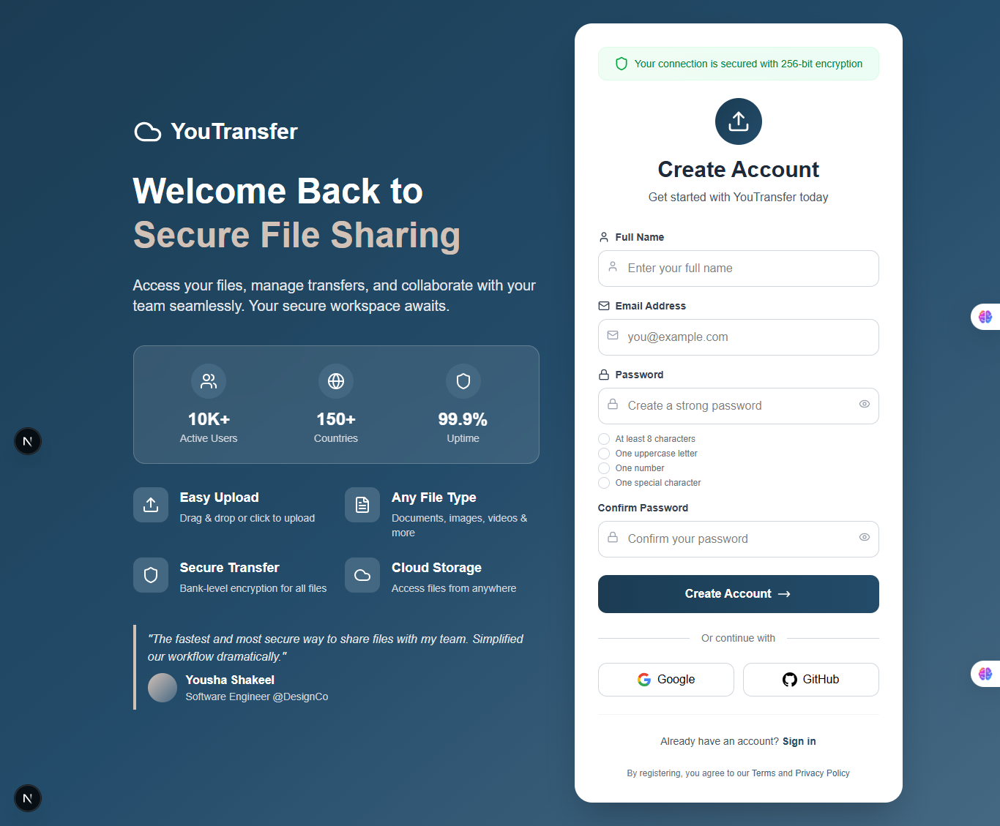
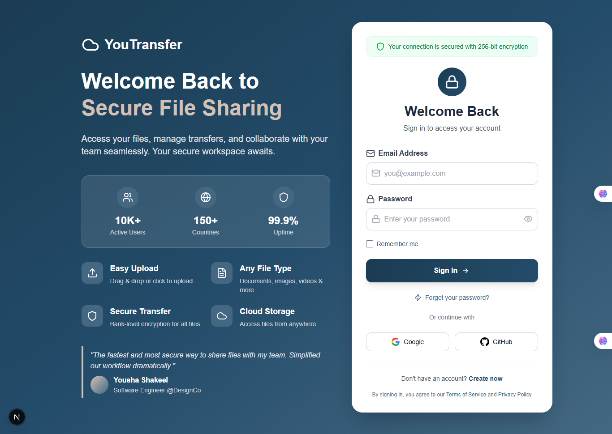
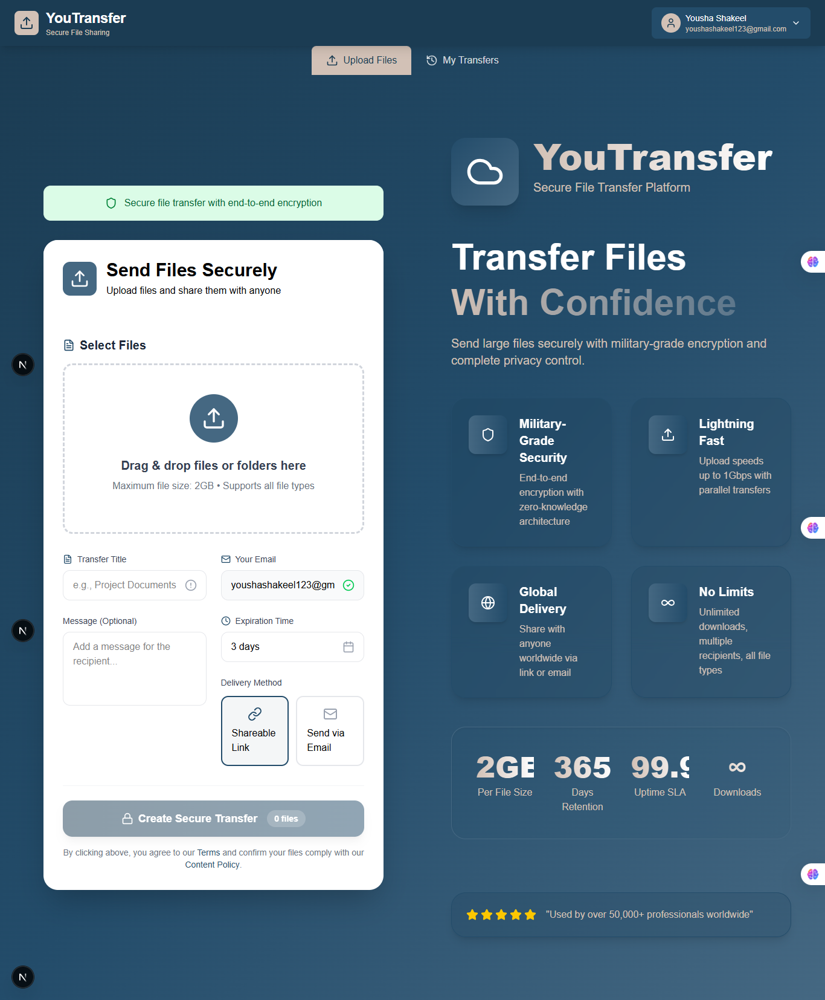
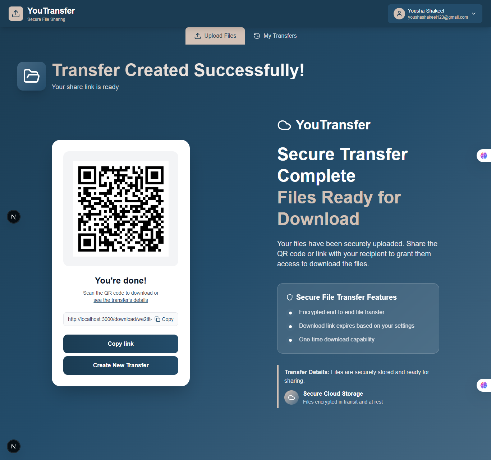
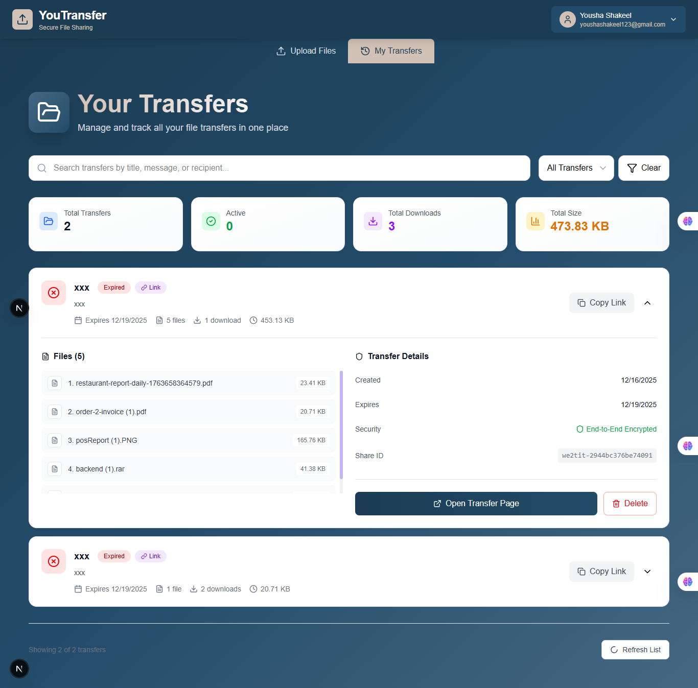
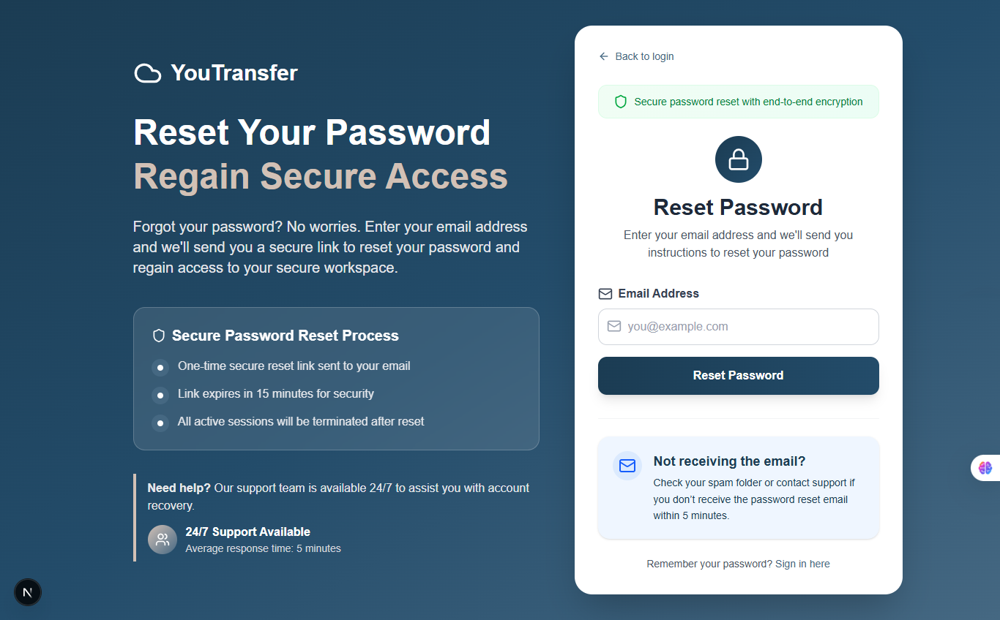
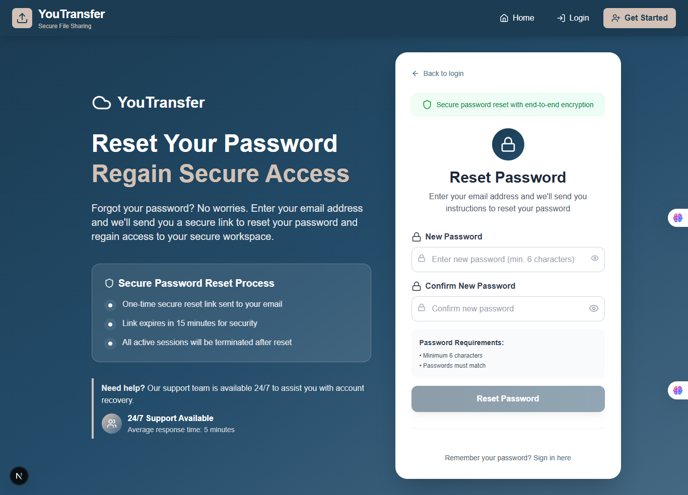
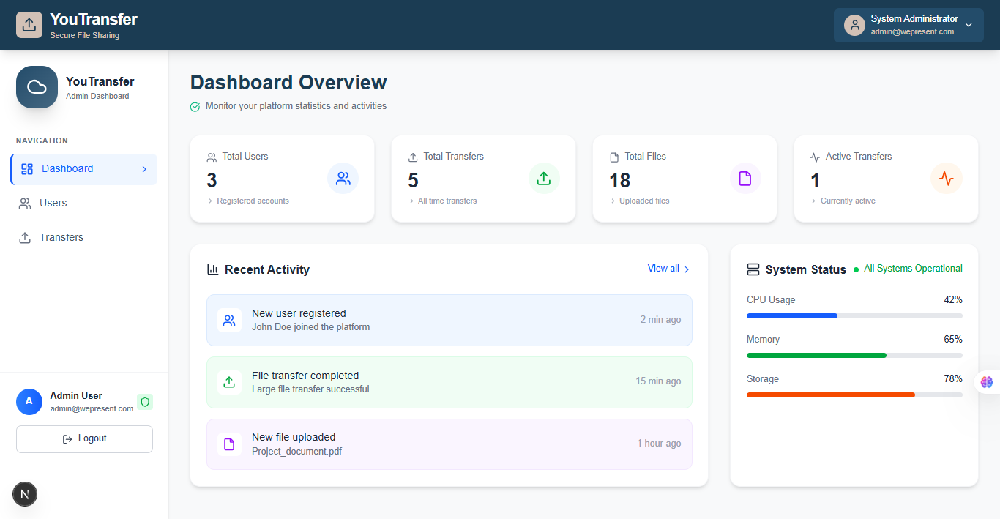
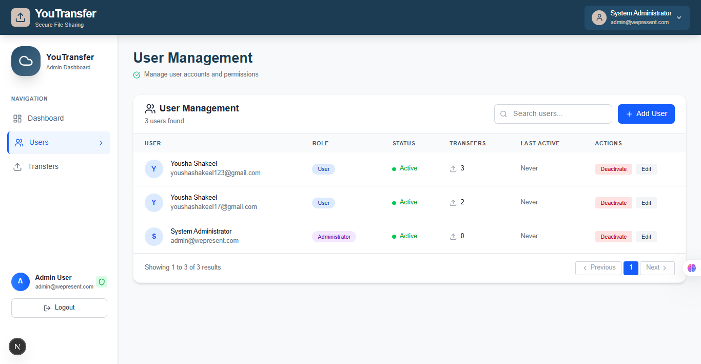
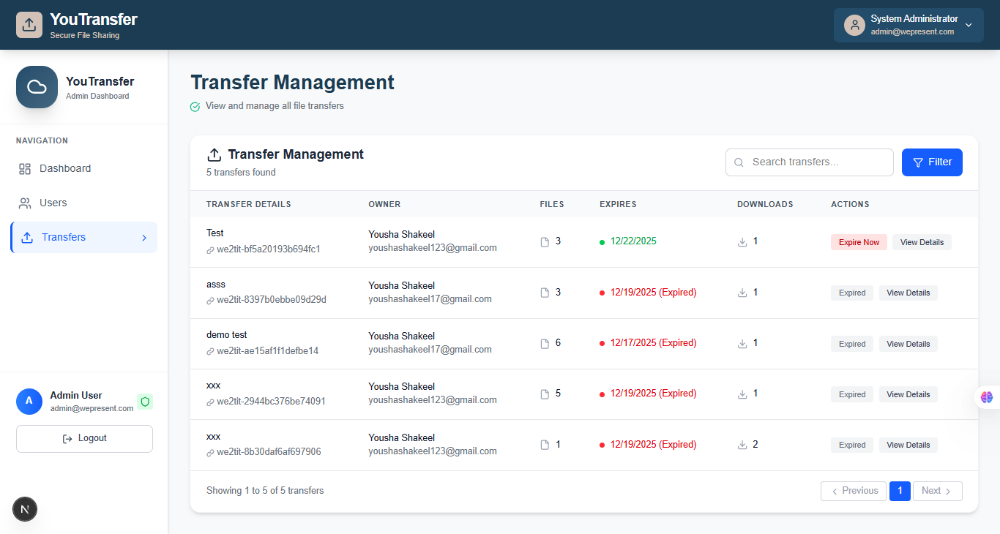

# 📤 YouTransfer - Secure File Sharing Platform

<h1 align="center">📤 YouTransfer</h1>

  <b>Secure File Transfer & Sharing Platform</b> 
  Next.js (Frontend) | Node.js + Express + MySQL (Backend)

<h2>📌 About Project</h2>

YouTransfer is a <b>secure file sharing platform</b> that allows users to upload files, generate shareable links, and send files via email with expiration dates. The platform includes comprehensive admin controls for user and transfer management.

<h2>🔄 Project Flow</h2>
<ol>
  <li><b>User Registration & Login</b> - Users create accounts with email verification</li>
  <li><b>File Upload</b> - Users navigate to Send Files page and select files</li>
  <li><b>Expiry Settings</b> - Set expiration days for shared files</li>
  <li><b>Recipient Selection</b> - Choose sharing method:
    <ul>
      <li>Generate shareable link</li>
      <li>Send directly to recipient's email</li>
    </ul>
  </li>
  <li><b>File Access</b> - Recipients access files via link or email</li>
  <li><b>Transfer Management</b> - Users can view all their transfers</li>
  <li><b>Admin Control</b> - Admin manages users and transfers</li>
  <li><b>Password Recovery</b> - Forgot password functionality with email reset</li>
</ol>

<h2>✨ Features</h2>

<h3>👤 User Features</h3>
<ul>
  <li>Secure registration and login</li>
  <li>File upload with progress tracking</li>
  <li>Customizable expiration dates for files</li>
  <li>Multiple sharing options (link or email)</li>
  <li>View personal transfer history</li>
  <li>Password reset via email</li>
</ul>

<h3>🛡️ Security Features</h3>
<ul>
  <li>JWT based authentication</li>
  <li>Encrypted passwords using bcrypt</li>
  <li>Secure file storage</li>
  <li>Expiring download links</li>
</ul>

<h3>👑 Admin Features</h3>
<ul>
  <li>View all registered users</li>
  <li>Activate/deactivate user accounts</li>
  <li>Monitor all file transfers</li>
  <li>Deactivate transfers if needed</li>
  <li>Complete system overview</li>
</ul>

<h2>🛠️ Tech Stack</h2>

<h3>Frontend</h3>
<ul>
  <li>React.js</li>
  <li>React Router DOM</li>
  <li>Axios for API calls</li>
  <li>CSS3 / Styled Components</li>
  <li>File upload handling</li>
</ul>

<h3>Backend</h3>
<ul>
  <li>Node.js</li>
  <li>Express.js</li>
  <li>MySQL Database</li>
  <li>Sequelize ORM</li>
  <li>JWT for authentication</li>
  <li>bcrypt for password hashing</li>
  <li>Multer for file uploads</li>
  <li>Nodemailer for email services</li>
  <li>Cloudinary for cloud storage</li>
</ul>

<h2>⚙️ Installation & Setup</h2>

<h4>1. Clone Repository</h4>
<pre>
git clone https://github.com/your-username/YouTransfer.git
cd YouTransfer
</pre>

<h4>2. Backend Setup</h4>
<pre>
cd backend
npm install
</pre>

Create <code>.env</code> file with:

<pre>
DB_HOST=localhost
DB_USER=root
DB_PASSWORD=yourpassword
DB_NAME=youtransfer_db
JWT_SECRET=your_jwt_secret
EMAIL_HOST=smtp.gmail.com
EMAIL_PORT=587
EMAIL_USER=your-email@gmail.com
EMAIL_PASS=your-email-password
CLOUDINARY_CLOUD_NAME=your_cloud_name
CLOUDINARY_API_KEY=your_api_key
CLOUDINARY_API_SECRET=your_api_secret
</pre>
<pre>
npm run seed  # Seed admin user
npm run dev   # Start development server
</pre>

<h4>3. Frontend Setup</h4>
<pre>
cd frontend
npm install
npm start
</pre>

<h2>📋 API Endpoints</h2>

<h3>Authentication</h3>
<ul>
  <li><code>POST /api/auth/register</code> - User registration</li>
  <li><code>POST /api/auth/login</code> - User login</li>
  <li><code>POST /api/auth/forgot-password</code> - Request password reset</li>
  <li><code>POST /api/auth/reset-password</code> - Reset password</li>
</ul>

<h3>File Operations</h3>
<ul>
  <li><code>POST /api/files/upload</code> - Upload file</li>
  <li><code>POST /api/files/share</code> - Share file</li>
  <li><code>GET /api/files/download/:token</code> - Download file</li>
  <li><code>GET /api/files/user-transfers</code> - Get user transfers</li>
</ul>

<h3>Admin Operations</h3>
<ul>
  <li><code>GET /api/admin/users</code> - Get all users</li>
  <li><code>PUT /api/admin/users/:id/status</code> - Update user status</li>
  <li><code>GET /api/admin/transfers</code> - Get all transfers</li>
  <li><code>PUT /api/admin/transfers/:id/status</code> - Update transfer status</li>
</ul>

<h2>🖼️ Application Screenshots</h2>

<h3>🏠 Home Page</h3>

<h3>📝 Registration Page</h3>

<h3>🔐 Login Page</h3>

<h3>📤 Send Files Page</h3>

<h3>🔗 Link Share Page</h3>

<h3>📊 Transfer Details Page</h3>

<h3>🔐 Forget Password Page</h3>

<h3>🔄 Reset Password Page</h3>

<h3>👑 Admin Dashboard</h3>

<h3>👥 Admin User Management</h3>

<h3>📦 Admin Transfer Management</h3>

<h2>🚀 Future Enhancements</h2>
<ul>
  <li>Real-time file transfer status</li>
  <li>Bulk file uploads</li>
  <li>Advanced file analytics</li>
  <li>Mobile application</li>
  <li>Two-factor authentication</li>
  <li>File preview before download</li>
  <li>Custom branding options</li>
</ul>

<h2>👨‍💻 Author</h2>

<b>Yousha Shakeel</b> 
Full-Stack Developer 
Pakistan 🇵🇰

⭐ If you find this project useful, please give it a star on GitHub!

📧 Contact: smyousha2002@gmail.com | 🔗 GitHub: github.com/Yousha2002

